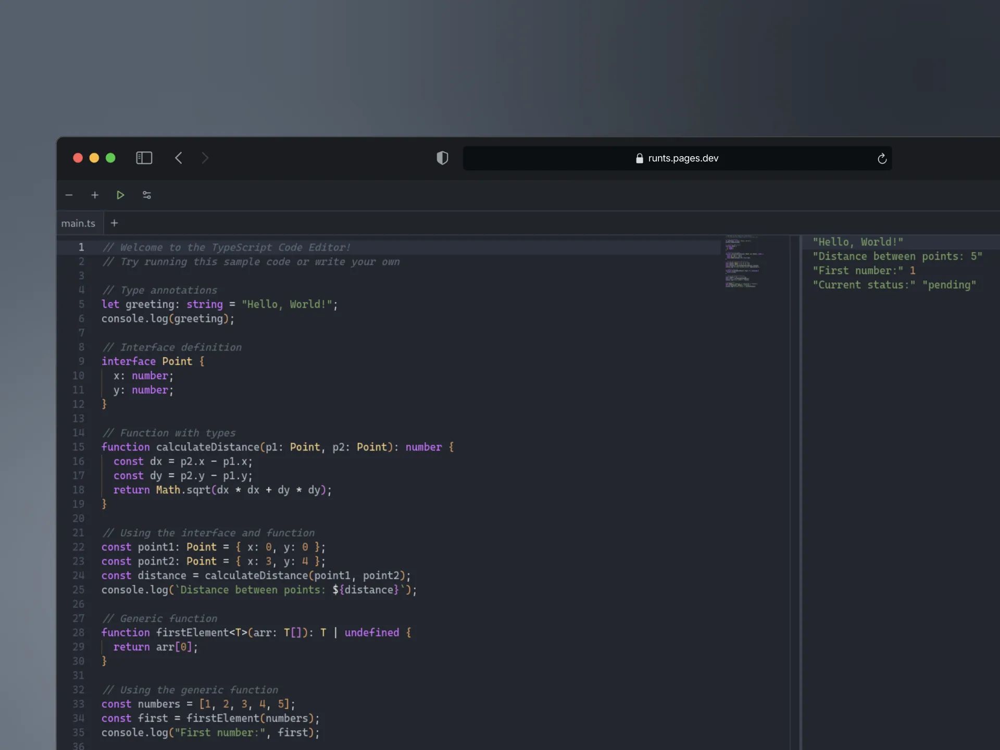

# RunTS 



Welcome to **RunTS**! This project is built with **Tauri**, **React**, and **TypeScript** to provide a lightweight yet powerful desktop application experience.

## 🚀 Project Overview

Currently, only the **web version** of the application is available. The **Tauri-based desktop application** is under development and will be available in the future. Stay tuned for updates!

## 🛠 Tech Stack

- **Framework**: [Tauri](https://tauri.app/)
- **Frontend**: [React](https://reactjs.org/), [TypeScript](https://www.typescriptlang.org/)
- **Build Tool**: [Vite](https://vitejs.dev/)
- **Styling**: [Tailwind CSS](https://tailwindcss.com/)
- **State Management**: [Zustand](https://github.com/pmndrs/zustand)

## 📁 Project Setup

To get started with this project, follow these steps:

### Prerequisites
- **Node.js** (v20 or above)
- **Rust** (Required for compiling Tauri backend, currently only the web version is available, future versions will support Linux, macOS, and Windows)
- **PNPM** (Package manager used in this project)

### Installation
1. Clone the repository:
   ```bash
   git clone https://github.com/acbcdev/RunTS.git
   ```
2. Navigate to the project directory:
   ```bash
   cd RunTS
   ```
3. Install the dependencies:
   ```bash
   pnpm install
   ```

### Running the Project
To run the project in development mode:
```bash
pnpm dev
```
This command will start the application with hot-reloading enabled for easy development.

## 📦 Dependencies and DevDependencies

- **Dependencies**
  - `react`, `react-dom`: `18`
  - `tauri`: Project framework for building desktop apps (future release).
  - `vite`: Development server and build tool for fast projects.
  - `typescript`: Superset of JavaScript for type safety.
  - `tailwindcss`: Utility-first CSS framework.
  - `zustand`: State management library for React.

## ⚙️ Configuration
The app includes various configuration options for the frontend and backend, which can be adjusted in the Tauri configuration files found in the `src-tauri/` directory.

## 🎨 UI Elements
The UI components are styled using **Tailwind CSS**, providing a consistent and modern look across all components. Buttons, modals, and other UI elements are crafted for responsiveness and user experience.

## 🧪 Testing
Testing functionality will be added in future updates. Stay tuned! 🚧

## 🤝 Contributing
Contributions are what make the open source community such an amazing place to learn, inspire, and create. Any contributions you make are **greatly appreciated**!
[guía de contribución](https://github.com/acbcdev/RunTS/blob/master/CONTRIBUTING.md)
If you have a suggestion that would make this project better, please fork the repository and create a pull request. You can also simply open an issue with the tag "enhancement".

Here's a quick guide:


Please check our [contribution guide](https://github.com/acbcdev/RunTS/blob/master/CONTRIBUTING.md) for more details on how to get started and follow best practices.

Happy coding! 🚀
